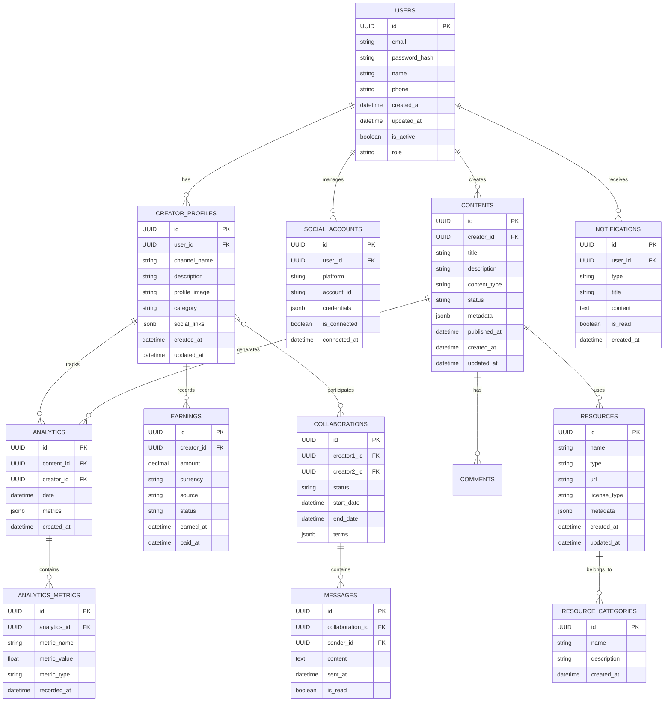

### 1. 핵심 사용자 관리
- `USERS`: 기본 사용자 정보 관리
- `CREATOR_PROFILES`: 크리에이터 전용 프로필 정보
- `SOCIAL_ACCOUNTS`: 연동된 소셜 미디어 계정 관리

### 2. 콘텐츠 관리
- `CONTENTS`: 크리에이터가 제작한 콘텐츠 관리
- `RESOURCES`: 콘텐츠 제작에 사용되는 리소스 관리 (음악, 이미지 등)
- `RESOURCE_CATEGORIES`: 리소스 분류 체계

### 3. 분석 및 성과 측정
- `ANALYTICS`: 콘텐츠 및 채널 성과 데이터
- `ANALYTICS_METRICS`: 세부 분석 지표 저장
- `EARNINGS`: 수익 추적 및 관리

### 4. 협업 및 커뮤니케이션
- `COLLABORATIONS`: 크리에이터 간 협업 관리
- `MESSAGES`: 협업 관련 메시지 관리
- `NOTIFICATIONS`: 시스템 알림 관리

### 주요 특징
1. UUID 사용: 보안 및 확장성 고려
2. Soft Delete: 데이터 복구 가능성 유지
3. 감사 추적: created_at, updated_at 필드 포함
4. JSON 지원: 유연한 메타데이터 저장 (PostgreSQL의 jsonb 타입 활용)

## 데이터베이스 구조 상세

### 1. 사용자(USERS) 중심 관계
- 모든 시작은 사용자(USERS) 테이블에서 시작됩니다
- 한 사용자는 여러 개의 크리에이터 프로필을 가질 수 있습니다
- 한 사용자는 여러 소셜 미디어 계정을 연결할 수 있습니다
- 한 사용자는 여러 콘텐츠를 생성할 수 있습니다
- 한 사용자는 여러 알림을 받을 수 있습니다

### 2. 크리에이터 프로필(CREATOR_PROFILES) 관계
- 각 크리에이터 프로필은 자신의 성과를 추적하는 여러 분석 데이터를 가집니다
- 각 크리에이터 프로필은 여러 수익 기록을 가질 수 있습니다
- 크리에이터들은 서로 협업 관계를 맺을 수 있습니다

### 3. 콘텐츠(CONTENTS) 관계
- 하나의 콘텐츠는 여러 댓글을 가질 수 있습니다
- 하나의 콘텐츠는 여러 분석 데이터를 생성합니다
- 하나의 콘텐츠는 여러 리소스(음악, 이미지 등)를 사용할 수 있습니다

### 4. 리소스(RESOURCES) 관계
- 각 리소스는 특정 카테고리에 속합니다 (예: 음악, 이미지, 비디오 등)

### 5. 협업(COLLABORATIONS) 관계
- 협업 프로젝트는 여러 메시지를 포함할 수 있습니다
- 두 크리에이터 간의 협업 내용과 조건을 기록합니다

### 6. 분석(ANALYTICS) 관계
- 분석 데이터는 여러 세부 측정 지표를 포함합니다
- 콘텐츠와 크리에이터의 성과를 추적합니다

